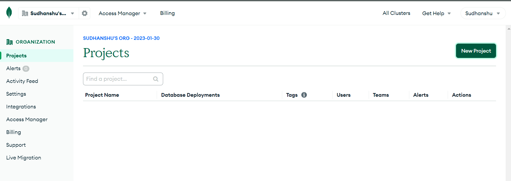
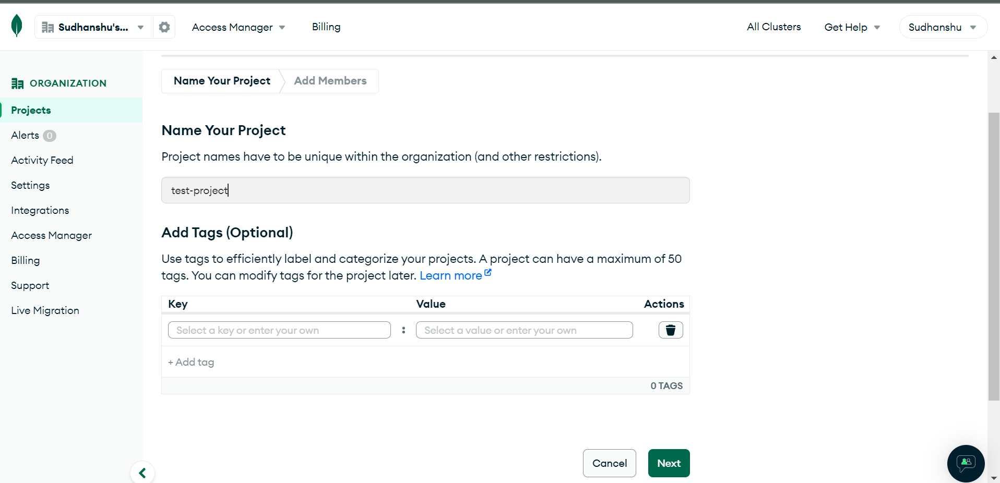
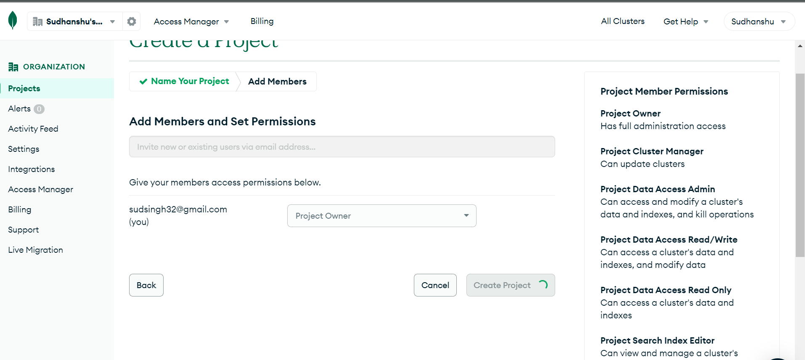
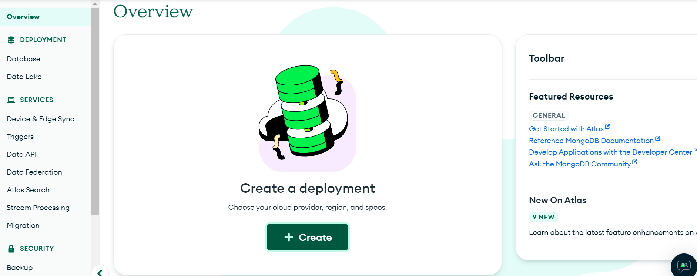
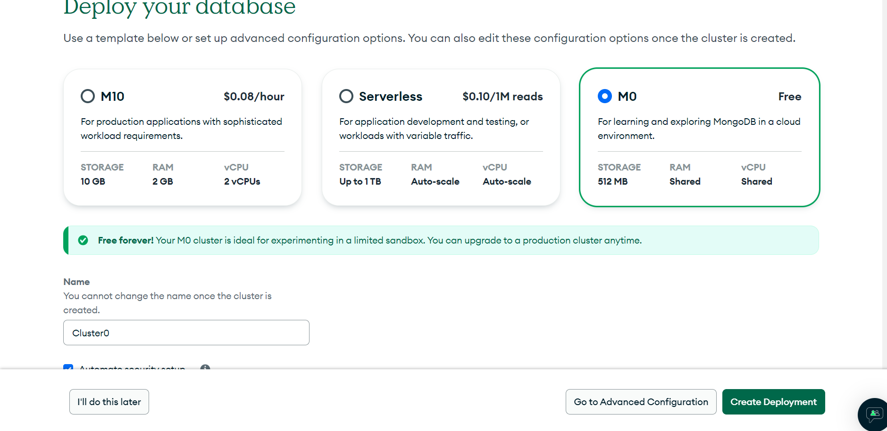
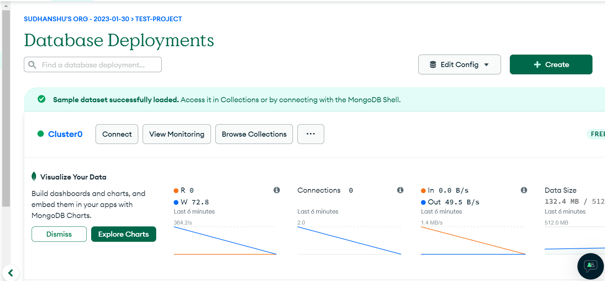
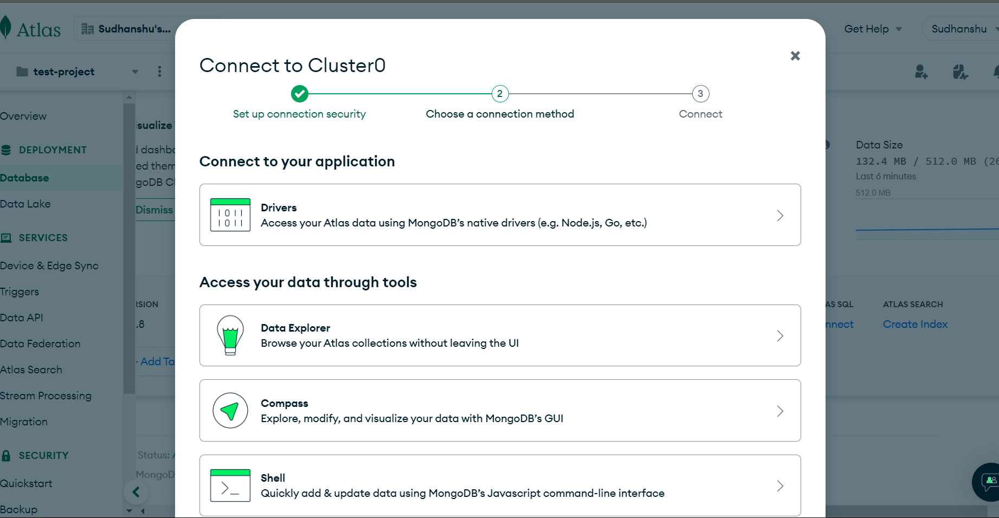
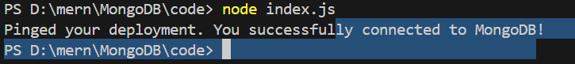

### MongoDB
- popular open-source, document-oriented NoSQL database program
- JSON-like documents with optional schemas, making data integration easier and faster
- MongoDB is known for its flexibility, scalability, and performance
- used in modern web development

### Steps to configure MongoDB
1. Login to [MongoDB](https://account.mongodb.com/account/login).
2. Create a new project.

3. Create a deployment,keeping evrything as default and selecting M0 cluster for learning purpose , you can change it later.

4. Create database user with adding username and password. Also,keep your password handy as it will be used later.
5. Database has been deployed.

6. Now connect your db to your local application.There are plenty of option to connect,I will choose for NodeJS

7. Follow the instruction and connect your database.

